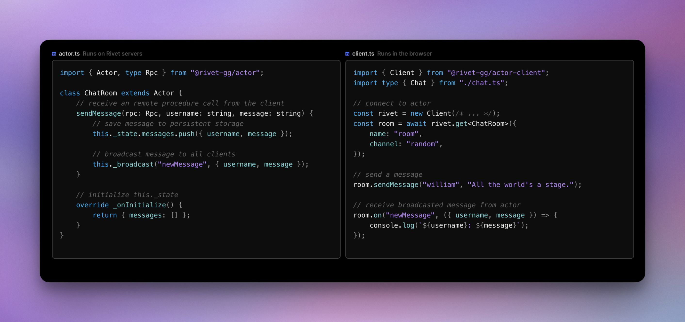

<p align="center">
<a href="https://rivet.gg">

</a>
</p>

<h3 align="center">可扩展。有状态。无服务器。</h3>
<h4 align="center">
Rivet 是构建实时、边缘或代理应用程序的平台。<br/>
没有 Redis 的限制或 Lambda 的超时。
</h4>
<p align="center">
<!-- <a href="https://github.com/rivet-gg/rivet/graphs/commit-activity"></a> -->
<a href="https://github.com/orgs/rivet-gg/discussions"></a>
<a href="https://rivet.gg/discord"></a>
<a href="https://twitter.com/rivet_gg"></a>
<a href="https://bsky.app/profile/rivet.gg"></a>
<a href="/LICENSE"></a>
</p>



## 简介

Rivet 附带简单的原语来构建您的后端。利用 Rivet Actors 轻松构建复杂的功能。

### 功能

- [**状态和持久性**](https://rivet.gg/docs/state)：状态感觉像内存，但工作起来像存储。非常适合动态、快速移动的应用程序。
- [**远程过程调用**](https://rivet.gg/docs/rpc)：为速度而构建的轻量级消息传递。包括完整的客户端/服务器类型安全。
- [**永久运行，空闲时休眠**](https://rivet.gg/docs/lifecycle)：始终可用，在网络不活动或超时时休眠，并根据需要立即唤醒。
- [**边缘网络**](https://rivet.gg/docs/edge)：自动将您的应用程序分发到用户附近，以实现超低延迟。
- [**容错**](https://rivet.gg/docs/fault-tolerance)：确保应用程序和状态在崩溃时具有弹性，且停机时间为零。

### 基础设施

- **与您的运行时配合使用**：支持 V8 隔离、WebAssembly 和容器，以与您现有的工具配合使用。
- **可扩展到零**：以低延迟和高吞吐量写入处理数百万个连接，同时通过即时参与者睡眠/唤醒周期节省成本。
- **无服务器和无配置**：使用一个命令进行部署。无需任何配置即可按需扩展。
- **比 Lambda 更简单，永不超时**：没有执行时间限制，没有复杂性 — 只是更好的无服务器。
- **内置监控**：包括开箱即用的监控，或自带监控。
- **采用您可以信赖的技术构建**：Rust、FoundationDB、[Rivet 工作流引擎](docs-internal/libraries/workflow/OVERVIEW.md) 和 [Rivet 编排器](packages/services/pegboard/) 使 Rivet 使用起来非常无聊。

### 用例

- AI 代理
- 游戏服务器
- 协作应用程序
- 本地优先应用程序
- Discord 活动
- 聊天应用程序
- Yjs 同步和存储
- 沙盒代码执行

## 入门

### 快速入门

_请参阅 [完整快速入门指南](https://rivet.gg/docs/setup) 了解全面演练。_

**步骤 1：安装 CLI**

```sh
# macOS & Linux & WSL
curl -fsSL https://releases.rivet.gg/rivet/latest/install.sh | sh

# Windows (cmd)
powershell -Command "iwr https://releases.rivet.gg/rivet/latest/install.ps1 -useb | iex"

# Windows (PowerShell)
iwr https://releases.rivet.gg/rivet/latest/install.ps1 -useb | iex
```

**步骤 2：创建项目并部署**

```sh
rivet init
cd my-app
rivet deploy
```

**步骤 3：监控**

访问 [Rivet Hub](https://hub.rivet.gg) 创建并测试您的参与者。

### 文档

- [**文档**](https://rivet.gg/docs): 了解如何使用 Rivet
- [**示例**](./examples/): 查看现有的 Rivet 项目
- [**贡献**](./CONTRIBUTING.md): 了解如何为 Rivet 做出贡献

### 运行 Rivet

- **自托管**
- [**本地开发和单容器**](https://rivet.gg/docs/self-hosting/single-container): 非常适合本地开发、快速单节点部署和测试 Rivet
- [**Docker Compose**](https://rivet.gg/docs/self-hosting/docker-compose): 非常适合业余爱好者和单节点部署
- [**手册**](https://rivet.gg/docs/self-hosting/manual-deployment): 无需 Docker 即可在您自己的虚拟机上运行
- [**Rivet云**](https://hub.rivet.gg)：部署 Rivet Actor 的最快、最经济、最可靠的方式，无需任何基础设施维护
- [**Rivet Enterprise**](https://rivet)

## 最后几点说明

此存储库纯属讽刺。如果您不理解其中的意思，请观看[此视频](https://www.youtube.com/watch?v=Km5XQxRrQvw)。


